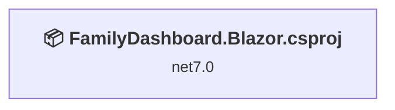
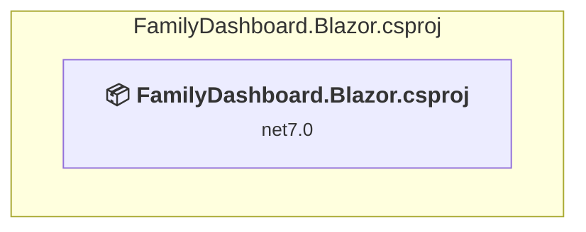

# Projects and dependencies analysis

This document provides a comprehensive overview of the projects and their dependencies in the context of upgrading to .NETCoreApp,Version=v10.0.

## Table of Contents

- [Executive Summary](#executive-Summary)
  - [Highlevel Metrics](#highlevel-metrics)
  - [Projects Compatibility](#projects-compatibility)
  - [Package Compatibility](#package-compatibility)
  - [API Compatibility](#api-compatibility)
- [Aggregate NuGet packages details](#aggregate-nuget-packages-details)
- [Top API Migration Challenges](#top-api-migration-challenges)
  - [Technologies and Features](#technologies-and-features)
  - [Most Frequent API Issues](#most-frequent-api-issues)
- [Projects Relationship Graph](#projects-relationship-graph)
- [Project Details](#project-details)

  - [FamilyDashboard.Blazor\FamilyDashboard.Blazor.csproj](#familydashboardblazorfamilydashboardblazorcsproj)

## Executive Summary

### Highlevel Metrics

| Metric | Count | Status |
| :--- | :---: | :--- |
| Total Projects | 1 | All require upgrade |
| Total NuGet Packages | 3 | All packages need upgrade |
| Total Code Files | 23 |  |
| Total Code Files with Incidents | 10 |  |
| Total Lines of Code | 656 |  |
| Total Number of Issues | 41 |  |
| Estimated LOC to modify | 37+ | at least 5.6% of codebase |

### Projects Compatibility

| Project | Target Framework | Difficulty | Package Issues | API Issues | Est. LOC Impact | Description |
| :--- | :---: | :---: | :---: | :---: | :---: | :--- |
| [FamilyDashboard.Blazor\FamilyDashboard.Blazor.csproj](#familydashboardblazorfamilydashboardblazorcsproj) | net7.0 | 🟢 Low | 3 | 37 | 37+ | AspNetCore, Sdk Style = True |

### Package Compatibility

| Status | Count | Percentage |
| :--- | :---: | :---: |
| ✅ Compatible | 0 | 0.0% |
| ⚠️ Incompatible | 0 | 0.0% |
| 🔄 Upgrade Recommended | 3 | 100.0% |
| ***Total NuGet Packages*** | ***3*** | ***100%*** |

### API Compatibility

| Category | Count | Impact |
| :--- | :---: | :--- |
| 🔴 Binary Incompatible | 9 | High - Require code changes |
| 🟡 Source Incompatible | 5 | Medium - Needs re-compilation and potential conflicting API error fixing |
| 🔵 Behavioral change | 23 | Low - Behavioral changes that may require testing at runtime |
| ✅ Compatible | 1624 |  |
| ***Total APIs Analyzed*** | ***1661*** |  |

## Aggregate NuGet packages details

| Package | Current Version | Suggested Version | Projects | Description |
| :--- | :---: | :---: | :--- | :--- |
| Microsoft.AspNetCore.Components.WebAssembly | 7.0.5 | 10.0.2 | [FamilyDashboard.Blazor.csproj](#familydashboardblazorfamilydashboardblazorcsproj) | NuGet package upgrade is recommended |
| Microsoft.AspNetCore.Components.WebAssembly.DevServer | 7.0.5 | 10.0.2 | [FamilyDashboard.Blazor.csproj](#familydashboardblazorfamilydashboardblazorcsproj) | NuGet package upgrade is recommended |
| Microsoft.Extensions.Http | 7.0.0 | 10.0.2 | [FamilyDashboard.Blazor.csproj](#familydashboardblazorfamilydashboardblazorcsproj) | NuGet package upgrade is recommended |

## Top API Migration Challenges

### Technologies and Features

| Technology | Issues | Percentage | Migration Path |
| :--- | :---: | :---: | :--- |

### Most Frequent API Issues

| API | Count | Percentage | Category |
| :--- | :---: | :---: | :--- |
| M:Microsoft.Extensions.Configuration.ConfigurationBinder.GetValue''1(Microsoft.Extensions.Configuration.IConfiguration,System.String) | 9 | 24.3% | Binary Incompatible |
| T:System.Net.Http.HttpContent | 7 | 18.9% | Behavioral Change |
| T:System.Text.Json.JsonDocument | 6 | 16.2% | Behavioral Change |
| T:System.Uri | 6 | 16.2% | Behavioral Change |
| M:System.TimeSpan.FromHours(System.Double) | 4 | 10.8% | Source Incompatible |
| M:System.Uri.#ctor(System.String) | 3 | 8.1% | Behavioral Change |
| M:System.TimeSpan.FromMinutes(System.Double) | 1 | 2.7% | Source Incompatible |
| M:Microsoft.Extensions.DependencyInjection.HttpClientFactoryServiceCollectionExtensions.AddHttpClient(Microsoft.Extensions.DependencyInjection.IServiceCollection) | 1 | 2.7% | Behavioral Change |

## Projects Relationship Graph

Legend:
📦 SDK-style project
⚙️ Classic project

## Project Details

### FamilyDashboard.Blazor\FamilyDashboard.Blazor.csproj

#### Project Info

- **Current Target Framework:** net7.0
- **Proposed Target Framework:** net10.0
- **SDK-style**: True
- **Project Kind:** AspNetCore
- **Dependencies**: 0
- **Dependants**: 0
- **Number of Files**: 46
- **Number of Files with Incidents**: 10
- **Lines of Code**: 656
- **Estimated LOC to modify**: 37+ (at least 5.6% of the project)

#### Dependency Graph

Legend:
📦 SDK-style project
⚙️ Classic project

### API Compatibility

| Category | Count | Impact |
| :--- | :---: | :--- |
| 🔴 Binary Incompatible | 9 | High - Require code changes |
| 🟡 Source Incompatible | 5 | Medium - Needs re-compilation and potential conflicting API error fixing |
| 🔵 Behavioral change | 23 | Low - Behavioral changes that may require testing at runtime |
| ✅ Compatible | 1624 |  |
| ***Total APIs Analyzed*** | ***1661*** |  |

